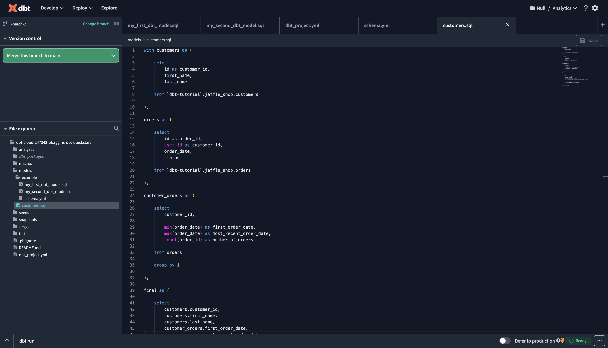
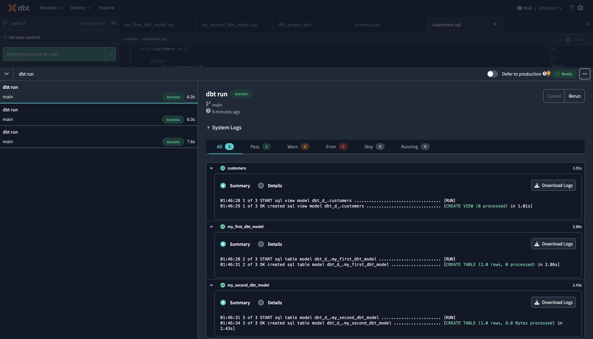
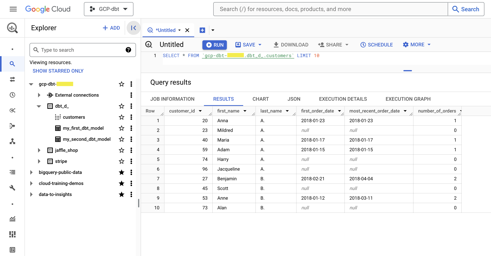
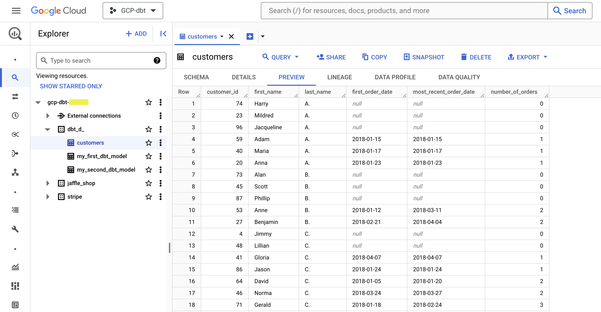
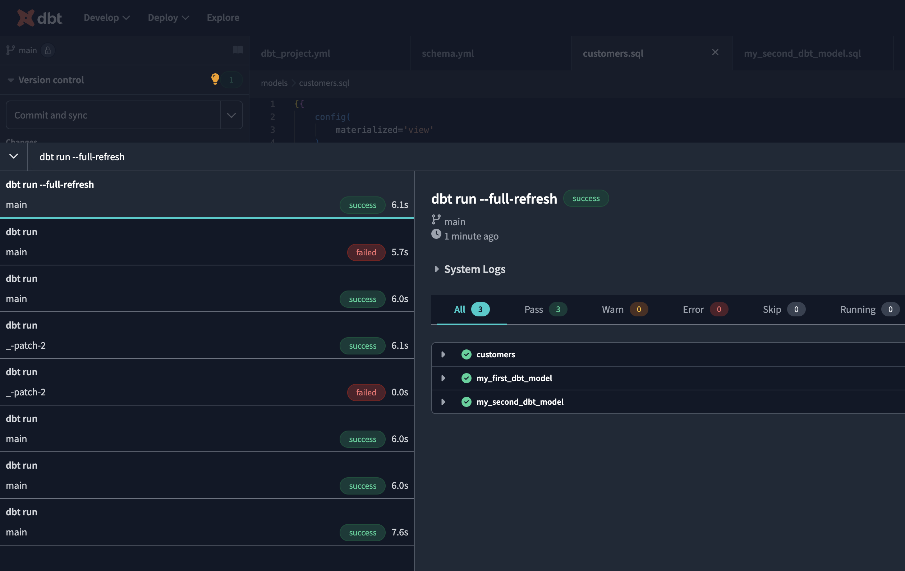
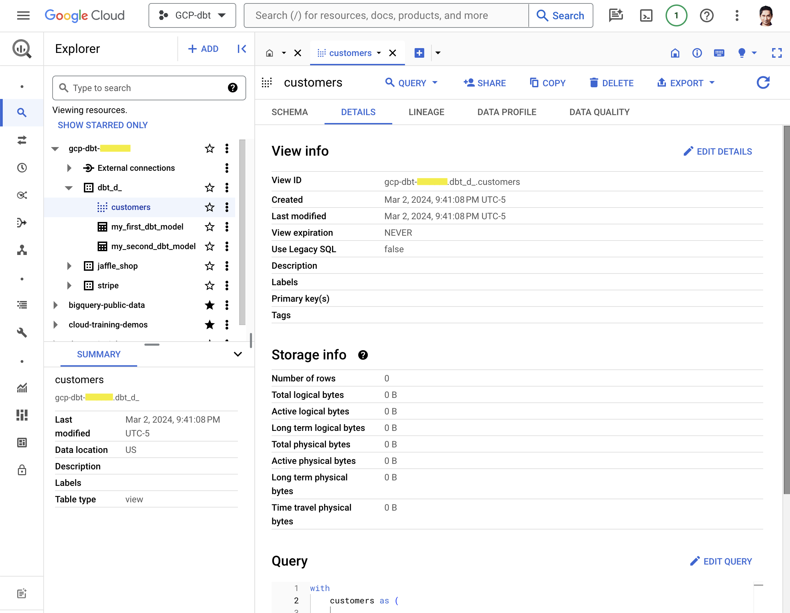
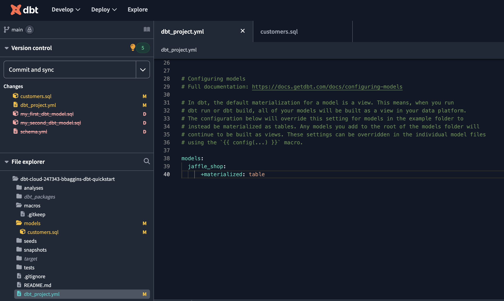
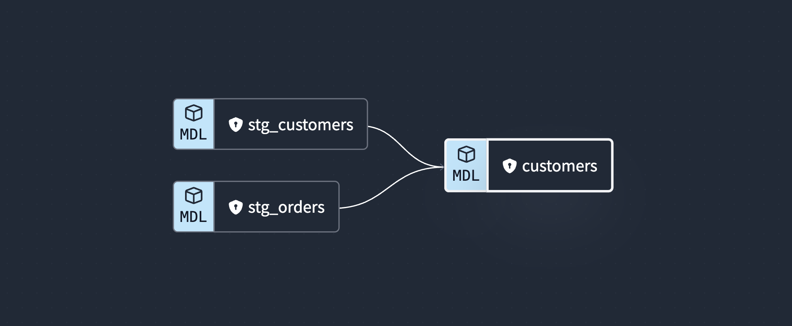
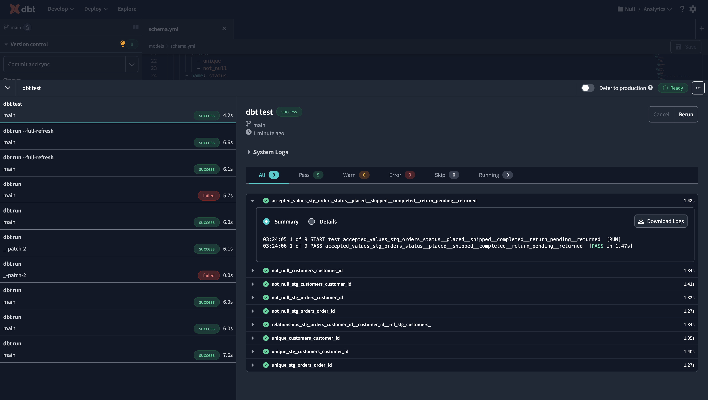

# GCP-dbt

## 1. Introduction

In this quickstart guide, you'll learn how to use dbt Cloud with BigQuery. It will show you how to:

- Create a Google Cloud Platform (GCP) project.
- Access sample data in a public dataset.
- Connect dbt Cloud to BigQuery.
- Take a sample query and turn it into a model in your dbt project. A model in dbt is a select statement.
- Add tests to your models.
- Document your models.
- Schedule a job to run.

### Prerequisites​

- You have a dbt Cloud account.
- You have a Google account.
- You can use a personal or work account to set up BigQuery through Google Cloud Platform (GCP).

## 2. Create a new GCP project​​

1. Go to the <a href="https://console.cloud.google.com/bigquery">BigQuery Console</a> after you log in to your Google account. If you have multiple Google accounts, make sure you’re using the correct one.
2. Create a new project from the <a href="https://console.cloud.google.com/projectcreate?previousPage=%2Fcloud-resource-manager%3Fwalkthrough_id%3Dresource-manager--create-project%26project%3D%26folder%3D%26organizationId%3D%23step_index%3D1&walkthrough_id=resource-manager--create-project">Manage resources</a> page. For more information, refer to Creating a project in the Google Cloud docs. GCP automatically populates the Project name field for you. You can change it to be more descriptive for your use. For example, ```dbt Learn - BigQuery Setup```.

## 3. Create BigQuery datasets​

From the <a href="https://console.cloud.google.com/bigquery">BigQuery Console</a>, click **Editor**. Make sure to select your newly created project, which is available at the top of the page.

Verify that you can run SQL queries. Copy and paste these queries into the Query Editor:

```
select * from `dbt-tutorial.jaffle_shop.customers`;
select * from `dbt-tutorial.jaffle_shop.orders`;
select * from `dbt-tutorial.stripe.payment`;
```

Click **Run**, then check for results from the queries. For example:

<p align="center">Bigquery Query Results</p>

Create new datasets from the BigQuery Console. Datasets in BigQuery are equivalent to schemas in a traditional database. On the **Create dataset** page:

- **Dataset ID** — Enter a name that fits the purpose. This name is used like schema in fully qualified references to your database objects such as `database.schema.table`. As an example for this guide, create one for `jaffle_shop` and another one for `stripe` afterward.
- **Data location** — Leave it blank (the default). It determines the GCP location of where your data is stored. The current default location is the US multi-region. All tables within this dataset will share this location.
- **Enable table expiration** — Leave it unselected (the default). The default for the billing table expiration is 60 days. Because billing isn’t enabled for this project, GCP defaults to deprecating tables.
- **Google-managed encryption key** — This option is available under **Advanced options**. Allow Google to manage encryption (the default).

<p align="center">Bigquery Create Dataset ID</p>

After you create the `jaffle_shop` dataset, create one for `stripe` with all the same values except for **Dataset ID**.

## 4. Generate BigQuery credentials​

In order to let dbt connect to your warehouse, you'll need to generate a keyfile. This is analogous to using a database username and password with most other data warehouses.

1. Start the <a href="https://console.cloud.google.com/apis/credentials/wizard">GCP credentials wizard</a>. Make sure your new project is selected in the header. If you do not see your account or project, click your profile picture to the right and verify you are using the correct email account. For **Credential Type**:
- From the **Select an API** dropdown, choose **BigQuery API**
- Select **Application data** for the type of data you will be accessing
- Click **Next** to create a new service account.

<p align="center">GCP credentials wizard</p>

2. Create a service account for your new project from the <a href="https://console.cloud.google.com/projectselector2/iam-admin/serviceaccounts?supportedpurview=project">Service accounts page</a>. As an example for this guide, you can:
- Type `dbt-user` as the **Service account name**
- From the **Select a role** dropdown, choose **BigQuery Job User** and **BigQuery Data Editor** roles and click **Continue**
- Leave the **Grant users access to this service account** fields blank
- Click **Done**

3. Create a service account key for your new project from the <a href="https://console.cloud.google.com/projectselector2/iam-admin/serviceaccounts?supportedpurview=project">Service accounts page</a>. When downloading the JSON file, make sure to use a filename you can easily remember. For example, `dbt-user-creds.json`. For security reasons, dbt Labs recommends that you protect this JSON file like you would your identity credentials; for example, don't check the JSON file into your version control software.

## 5. Connect dbt Cloud to BigQuery​​

1. Create a new project in <a href="https://cloud.getdbt.com/">dbt Cloud</a>. From **Account settings** (using the gear menu in the top right corner), click **+ New Project**.
2. Enter a project name and click **Continue**.
3. For the warehouse, click **BigQuery** then **Next** to set up your connection.

<p align="center">Connecting dbt Cloud to BigQuery​​</p>
<p align="center">Connecting dbt Cloud to BigQuery​​</p>

4. Click **Upload a Service Account JSON File** in settings.
5. Select the JSON file you downloaded and dbt Cloud will fill in all the necessary fields.
6. Click **Test Connection**. This verifies that dbt Cloud can access your BigQuery account.
7. Click **Next** if the test succeeded. If it failed, you might need to go back and regenerate your BigQuery credentials.

## 6. Set up a dbt Cloud managed repository​

When you develop in dbt Cloud, you can leverage <a href="https://docs.getdbt.com/docs/collaborate/git-version-control">Git</a> to version control your code.

To connect to a repository, you can either set up a dbt Cloud-hosted <a href="https://docs.getdbt.com/docs/collaborate/git/managed-repository">managed repository</a> or directly connect to a <a href="https://docs.getdbt.com/docs/cloud/git/connect-github">supported git provider</a>. Managed repositories are a great way to trial dbt without needing to create a new repository. In the long run, it's better to connect to a supported git provider to use features like automation and <a href="https://docs.getdbt.com/docs/deploy/continuous-integration">continuous integration</a>.

To set up a managed repository:

1. Under "Setup a repository", select **Managed**.
2. Type a name for your repo such as `bbaggins-dbt-quickstart`
3. Click **Create**. It will take a few seconds for your repository to be created and imported.
4. Once you see the "Successfully imported repository," click **Continue**.


## 7. Initialize your dbt project​ and start developing​

Now that you have a repository configured, you can initialize your project and start development in dbt Cloud:

1. Click **Start developing in the IDE**. It might take a few minutes for your project to spin up for the first time as it establishes your git connection, clones your repo, and tests the connection to the warehouse.
2. Above the file tree to the left, click **Initialize dbt project**. This builds out your folder structure with example models.
3. Make your initial commit by clicking **Commit and sync**. Use the commit message `initial commit` and click **Commit**. This creates the first commit to your managed repo and allows you to open a branch where you can add new dbt code.
4. You can now directly query data from your warehouse and execute `dbt run`. You can try this out now:
   - Click **+ Create new file**, add this query to the new file, and click **Save as** to save the new file:
   - ```
     select * from `dbt-tutorial.jaffle_shop.customers`
     ```

In the command line bar at the bottom, enter `dbt run` and click *Enter*. You should see a `dbt run succeeded message`.

## 8. Build your first model​

1. Under **Version Control** on the left, click **Create branch**. You can name it `add-customers-model`. You need to create a new branch since the main branch is set to read-only mode.
2. Click the ... next to the `models` directory, then select **Create file**.
3. Name the file `customers.sql`, then click **Create**.
4. Copy the following query into the file and click **Save**.
```
with customers as (

    select
        id as customer_id,
        first_name,
        last_name

    from `dbt-tutorial`.jaffle_shop.customers

),

orders as (

    select
        id as order_id,
        user_id as customer_id,
        order_date,
        status

    from `dbt-tutorial`.jaffle_shop.orders

),

customer_orders as (

    select
        customer_id,

        min(order_date) as first_order_date,
        max(order_date) as most_recent_order_date,
        count(order_id) as number_of_orders

    from orders

    group by 1

),

final as (

    select
        customers.customer_id,
        customers.first_name,
        customers.last_name,
        customer_orders.first_order_date,
        customer_orders.most_recent_order_date,
        coalesce(customer_orders.number_of_orders, 0) as number_of_orders

    from customers

    left join customer_orders using (customer_id)

)

select * from final
```
<p align="center">customer model​​</p>

6. Enter `dbt run` in the command prompt at the bottom of the screen. You should get a successful run and see the three models.

<p align="center">dbt run​​</p>

Later, you can connect your business intelligence (BI) tools to these views and tables so they only read cleaned up data rather than raw data in your BI tool.

<p align="center">Query the view in BigQuery​​</p>

## 9. Change the way your model is materialized​

One of the most powerful features of dbt is that you can change the way a model is materialized in your warehouse, simply by changing a configuration value. You can change things between tables and views by changing a keyword rather than writing the data definition language (DDL) to do this behind the scenes.

By default, everything gets created as a view. You can override that at the directory level so everything in that directory will materialize to a different materialization.

1. Edit your dbt_project.yml file.
   - Update your project name to:

```name: 'jaffle_shop'```

   - Configure `jaffle_shop` so everything in it will be materialized as a table; and configure `example` so everything in it will be materialized as a view. Update your `models` config block to:

```
models:
  jaffle_shop:
    +materialized: table
  example:
    +materialized: view
```

   - Click **Save**.

2. Enter the `dbt run` command. Your `customers` model should now be built as a table!

<p align="center">Preview the data in the table in BigQuery​​</p>

3. Edit `models/customers.sql` to override the `dbt_project.yml` for the `customers` model only by adding the following snippet to the top, and click **Save**:

```
{{
  config(
    materialized='view'
  )
}}

with customers as (

    select
        id as customer_id
        ...

)
```

4. Enter the `dbt run` command. Your model, `customers`, should now build as a view.

   - BigQuery users need to run `dbt run --full-refresh` instead of `dbt run` to full apply materialization changes.

<p align="center">dbt run --full-refresh​​</p>


5. Enter the `dbt run --full-refresh` command for this to take effect in your warehouse.

<p align="center">Details of the view in BigQuery​​</p>

## 10. Delete the example models​

You can now delete the files that dbt created when you initialized the project:

1. Delete the `models/example/` directory.

2. Delete the `example:` key from your `dbt_project.yml` file, and any configurations that are listed under it.

```
# before
models:
  jaffle_shop:
    +materialized: table
    example:
      +materialized: view
```

```
# after
models:
  jaffle_shop:
    +materialized: table

```

3. Save your changes.

<p align="center">dbt project after deleting the example files and configurations​​</p>

## 11. Build models on top of other models​

As a best practice in SQL, you should separate logic that cleans up your data from logic that transforms your data. You have already started doing this in the existing query by using common table expressions (CTEs).

Now you can experiment by separating the logic out into separate models and using the ref function to build models on top of other models:

<p align="center">The DAG we want for our dbt project</p>

1. Create a new SQL file, `models/stg_customers.sql`, with the SQL from the `customers` CTE in our original query.

2. Create a second new SQL file, `models/stg_orders.sql`, with the SQL from the `orders` CTE in our original query.

**models/stg_customers.sql**
```
select
    id as customer_id,
    first_name,
    last_name

from `dbt-tutorial`.jaffle_shop.customers
```

**models/stg_orders.sql**
```
select
    id as order_id,
    user_id as customer_id,
    order_date,
    status

from `dbt-tutorial`.jaffle_shop.orders
```

3. Edit the SQL in your `models/customers.sql` file as follows:

**models/customers.sql**
```
with customers as (

    select * from {{ ref('stg_customers') }}

),

orders as (

    select * from {{ ref('stg_orders') }}

),

customer_orders as (

    select
        customer_id,

        min(order_date) as first_order_date,
        max(order_date) as most_recent_order_date,
        count(order_id) as number_of_orders

    from orders

    group by 1

),

final as (

    select
        customers.customer_id,
        customers.first_name,
        customers.last_name,
        customer_orders.first_order_date,
        customer_orders.most_recent_order_date,
        coalesce(customer_orders.number_of_orders, 0) as number_of_orders

    from customers

    left join customer_orders using (customer_id)

)

select * from final
```

4. Execute `dbt run`.

This time, when you performed a `dbt run`, separate views/tables were created for `stg_customers`, `stg_orders` and `customers`. dbt inferred the order to run these models. Because `customers` depends on `stg_customers` and `stg_orders`, dbt builds `customers` last. You do not need to explicitly define these dependencies.

## 12. Add tests to your models​

Adding tests to a project helps validate that your models are working correctly.

To add tests to your project:

1. Create a new YAML file in the `models` directory, named `models/schema.yml`

2. Add the following contents to the file:

**models/schema.yml**
```
version: 2

models:
  - name: customers
    columns:
      - name: customer_id
        tests:
          - unique
          - not_null

  - name: stg_customers
    columns:
      - name: customer_id
        tests:
          - unique
          - not_null

  - name: stg_orders
    columns:
      - name: order_id
        tests:
          - unique
          - not_null
      - name: status
        tests:
          - accepted_values:
              values: ['placed', 'shipped', 'completed', 'return_pending', 'returned']
      - name: customer_id
        tests:
          - not_null
          - relationships:
              to: ref('stg_customers')
              field: customer_id
```

3. Run `dbt test`, and confirm that all your tests passed.

<p align="center">dbt test</p>

When you run `dbt test`, dbt iterates through your YAML files, and constructs a query for each test. Each query will return the number of records that fail the test. If this number is 0, then the test is successful.

## 13. Document your models​
## 14. Commit your changes​
## 15. Deploy dbt​


