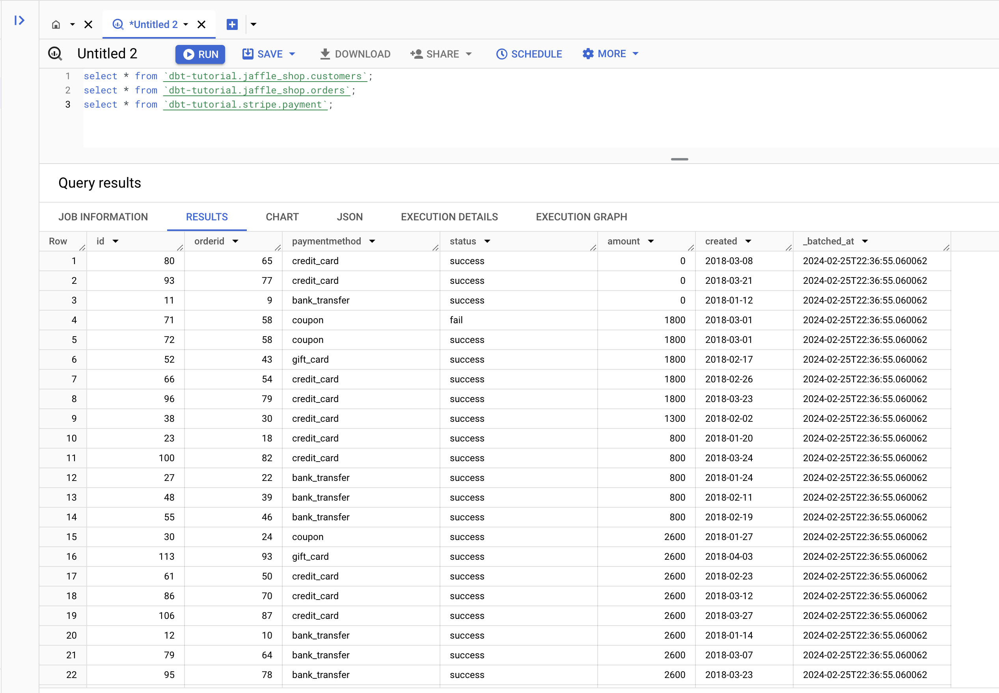
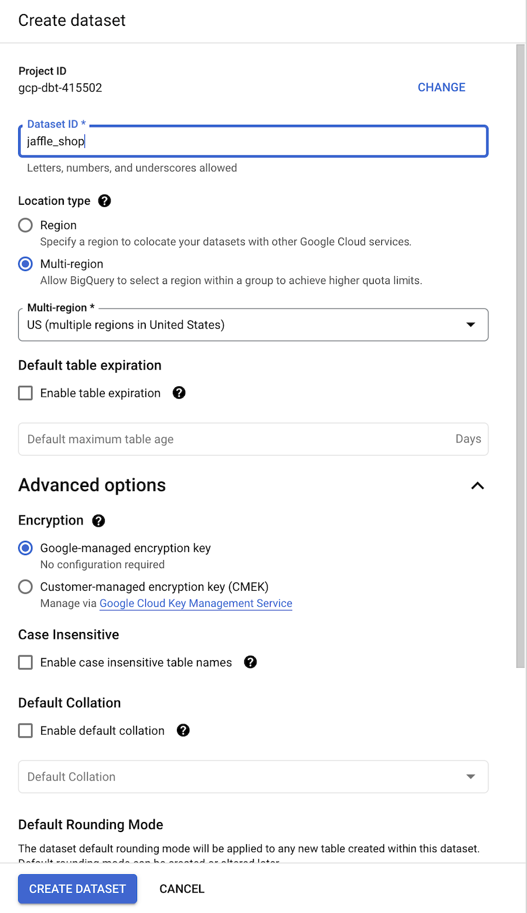
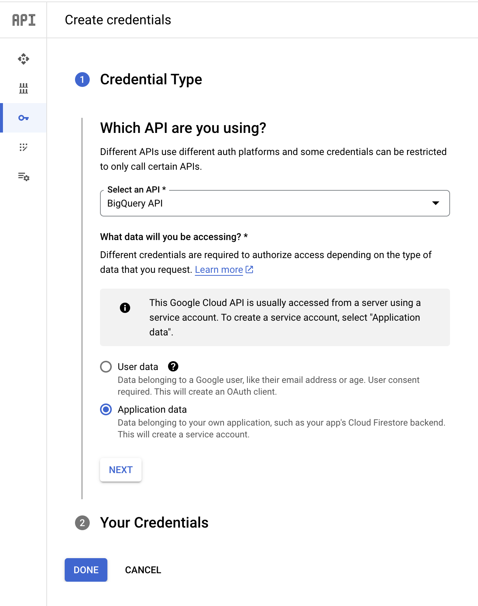
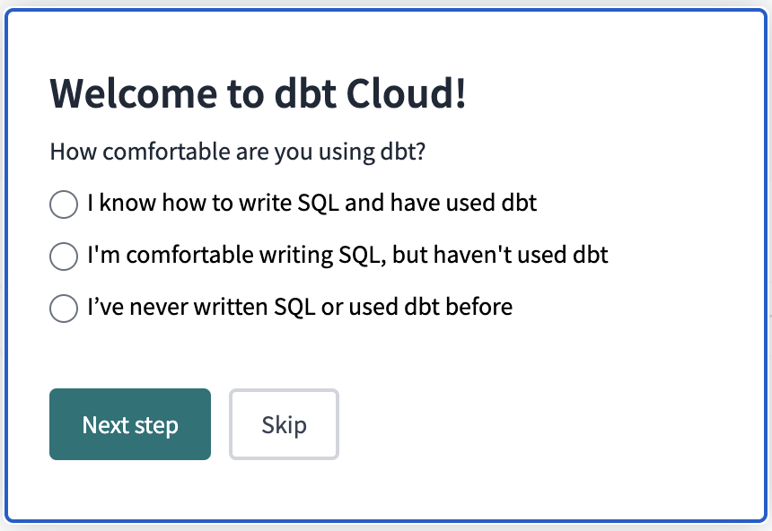
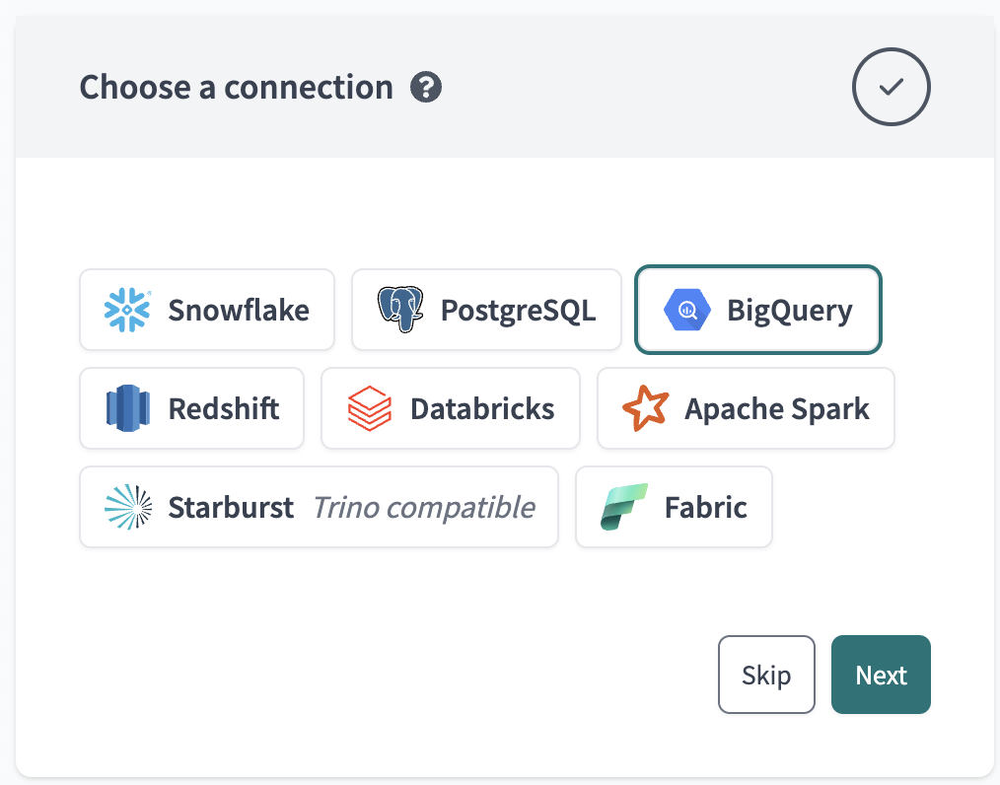

# GCP-dbt

## 1. Introduction

In this quickstart guide, you'll learn how to use dbt Cloud with BigQuery. It will show you how to:

- Create a Google Cloud Platform (GCP) project.
- Access sample data in a public dataset.
- Connect dbt Cloud to BigQuery.
- Take a sample query and turn it into a model in your dbt project. A model in dbt is a select statement.
- Add tests to your models.
- Document your models.
- Schedule a job to run.

### Prerequisites​

- You have a dbt Cloud account.
- You have a Google account.
- You can use a personal or work account to set up BigQuery through Google Cloud Platform (GCP).

## 2. Create a new GCP project​​

1. Go to the <a href="https://console.cloud.google.com/bigquery">BigQuery Console</a> after you log in to your Google account. If you have multiple Google accounts, make sure you’re using the correct one.
2. Create a new project from the <a href="https://console.cloud.google.com/projectcreate?previousPage=%2Fcloud-resource-manager%3Fwalkthrough_id%3Dresource-manager--create-project%26project%3D%26folder%3D%26organizationId%3D%23step_index%3D1&walkthrough_id=resource-manager--create-project">Manage resources</a> page. For more information, refer to Creating a project in the Google Cloud docs. GCP automatically populates the Project name field for you. You can change it to be more descriptive for your use. For example, ```dbt Learn - BigQuery Setup```.

## 3. Create BigQuery datasets​

From the <a href="https://console.cloud.google.com/bigquery">BigQuery Console</a>, click **Editor**. Make sure to select your newly created project, which is available at the top of the page.

Verify that you can run SQL queries. Copy and paste these queries into the Query Editor:

```
select * from `dbt-tutorial.jaffle_shop.customers`;
select * from `dbt-tutorial.jaffle_shop.orders`;
select * from `dbt-tutorial.stripe.payment`;
```

Click **Run**, then check for results from the queries. For example:

<p align="center">Bigquery Query Results</p>

Create new datasets from the BigQuery Console. Datasets in BigQuery are equivalent to schemas in a traditional database. On the **Create dataset** page:

- **Dataset ID** — Enter a name that fits the purpose. This name is used like schema in fully qualified references to your database objects such as `database.schema.table`. As an example for this guide, create one for `jaffle_shop` and another one for `stripe` afterward.
- **Data location** — Leave it blank (the default). It determines the GCP location of where your data is stored. The current default location is the US multi-region. All tables within this dataset will share this location.
- **Enable table expiration** — Leave it unselected (the default). The default for the billing table expiration is 60 days. Because billing isn’t enabled for this project, GCP defaults to deprecating tables.
- **Google-managed encryption key** — This option is available under **Advanced options**. Allow Google to manage encryption (the default).

<p align="center">Bigquery Create Dataset ID</p>

After you create the `jaffle_shop` dataset, create one for `stripe` with all the same values except for **Dataset ID**.

## 4. Generate BigQuery credentials​

In order to let dbt connect to your warehouse, you'll need to generate a keyfile. This is analogous to using a database username and password with most other data warehouses.

1. Start the <a href="https://console.cloud.google.com/apis/credentials/wizard">GCP credentials wizard</a>. Make sure your new project is selected in the header. If you do not see your account or project, click your profile picture to the right and verify you are using the correct email account. For **Credential Type**:
- From the **Select an API** dropdown, choose **BigQuery API**
- Select **Application data** for the type of data you will be accessing
- Click **Next** to create a new service account.

<p align="center">GCP credentials wizard</p>

2. Create a service account for your new project from the <a href="https://console.cloud.google.com/projectselector2/iam-admin/serviceaccounts?supportedpurview=project">Service accounts page</a>. As an example for this guide, you can:
- Type `dbt-user` as the **Service account name**
- From the **Select a role** dropdown, choose **BigQuery Job User** and **BigQuery Data Editor** roles and click **Continue**
- Leave the **Grant users access to this service account** fields blank
- Click **Done**

3. Create a service account key for your new project from the <a href="https://console.cloud.google.com/projectselector2/iam-admin/serviceaccounts?supportedpurview=project">Service accounts page</a>. When downloading the JSON file, make sure to use a filename you can easily remember. For example, `dbt-user-creds.json`. For security reasons, dbt Labs recommends that you protect this JSON file like you would your identity credentials; for example, don't check the JSON file into your version control software.

## 5. Connect dbt Cloud to BigQuery​​

1. Create a new project in <a href="https://cloud.getdbt.com/">dbt Cloud</a>. From **Account settings** (using the gear menu in the top right corner), click **+ New Project**.
2. Enter a project name and click **Continue**.
3. For the warehouse, click **BigQuery** then **Next** to set up your connection.

<p align="center">Connecting dbt Cloud to BigQuery​​</p>
<p align="center">Connecting dbt Cloud to BigQuery​​</p>


4. Click **Upload a Service Account JSON File** in settings.
5. Select the JSON file you downloaded and dbt Cloud will fill in all the necessary fields.
6. Click **Test Connection**. This verifies that dbt Cloud can access your BigQuery account.
7. Click **Next** if the test succeeded. If it failed, you might need to go back and regenerate your BigQuery credentials.

## 6. Set up a dbt Cloud managed repository​

When you develop in dbt Cloud, you can leverage <a href="https://docs.getdbt.com/docs/collaborate/git-version-control">Git</a> to version control your code.

To connect to a repository, you can either set up a dbt Cloud-hosted <a href="https://docs.getdbt.com/docs/collaborate/git/managed-repository">managed repository</a> or directly connect to a <a href="https://docs.getdbt.com/docs/cloud/git/connect-github">supported git provider</a>. Managed repositories are a great way to trial dbt without needing to create a new repository. In the long run, it's better to connect to a supported git provider to use features like automation and <a href="https://docs.getdbt.com/docs/deploy/continuous-integration">continuous integration</a>.

To set up a managed repository:

Under "Setup a repository", select **Managed**.
Type a name for your repo such as bbaggins-dbt-quickstart
Click **Create**. It will take a few seconds for your repository to be created and imported.
Once you see the "Successfully imported repository," click **Continue**.


## 7. Initialize your dbt project​ and start developing​
## 8. Build your first model​
## 9. Change the way your model is materialized​
## 10. Delete the example models​
## 11. Build models on top of other models​
## 12. Add tests to your models​
## 13. Document your models​
## 14. Commit your changes​
## 15. Deploy dbt​


